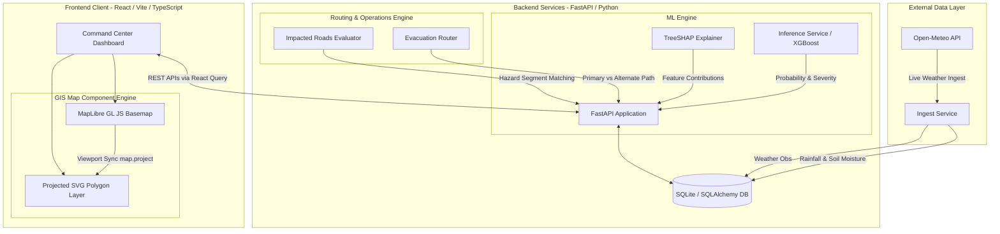
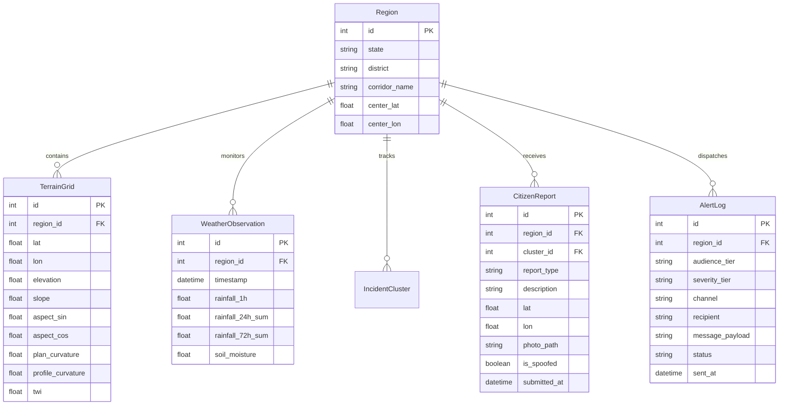

# NER-DRISHTI: System Architecture & Technical Knowledge Base

This document provides a comprehensive, production-grade architectural specification of **NER-DRISHTI**, an AI-powered Landslide Early-Warning and Decision-Support Platform built for the North Eastern Region (NER) of India. 

It is designed as an authoritative technical blueprint: any engineer or system architect can use this specification to understand, construct, deploy, or scale the complete end-to-end system architecture.

---

## 1. System Overview & Core Objective

**NER-DRISHTI** addresses high-frequency landslide risks along critical national highway corridors in North East India (e.g., NH-13 in Arunachal Pradesh, NH-10 in Sikkim, and NH-6 in Meghalaya). 

The platform delivers real-time situational awareness and actionable decision support across four pillars:
1. **Risk Prediction**: Probability (0–100%) and 4-tier severity rating (*Low*, *Moderate*, *High*, *Critical*).
2. **Geospatial Mapping**: High-resolution, corridor-aligned terrain grid overlay on interactive GIS maps.
3. **Explainable AI (XAI)**: SHAP (SHapley Additive exPlanations) factor contribution attribution for every grid cell.
4. **Actionable Operations**: Region-specific impacted road segment detection, automated evacuation rerouting around hazard segments, and multi-tier public/authority alerting.

---

## 2. High-Level Architecture

The system follows a decoupled, API-first client-server architecture:



---

## 3. Technology Stack

### Frontend Architecture
* **Framework**: React 18 + TypeScript + Vite
* **Routing**: Wouter (`/`, `/reports`, `/operations`, `/replay`, `/login`)
* **State & Query Management**: `@tanstack/react-query` (with 20s stale-time & auto-refetch)
* **GIS & Map Engine**: MapLibre GL JS + Projected SVG Overlay Engine
* **Styling & UI**: Vanilla CSS Design Tokens (`index.css`), TailwindCSS, Lucide Icons, Shadcn UI primitives

### Backend Architecture
* **Framework**: Python 3.13 + FastAPI + Uvicorn
* **Database**: SQLite (`nerdrishti.db`) via SQLAlchemy Async Engine (`aiosqlite`)
* **ML & Explainability**: XGBoost Classifier fallback + SHAP (SHapley Additive exPlanations)
* **API Rate Limiting**: Slowapi (`60 requests/minute` per client IP)
* **Client Generation**: OpenAPI REST client specification (`@workspace/api-client-react`)

---

## 4. Data Model & Database Schema

The database relies on 6 core entities managed via SQLAlchemy ORM models (`backend/models.py`):



---

## 5. Core Subsystem & Component Specifications

### 5.1. Situation Room & Risk Grid Engine (`/`)
* **Grid Seeding & Corridor Alignment**:
  * Terrain grid cells are seeded along real highway corridor waypoints rather than arbitrary rectangular blocks:
    * **Region 1 (Arunachal Pradesh - NH-13)**: Bhalukpong (`27.15°N, 92.40°E`) $\rightarrow$ Rupa $\rightarrow$ Bomdila (`27.28°N, 92.60°E`).
    * **Region 2 (Sikkim - NH-10)**: Gangtok (`27.33°N, 88.61°E`) $\rightarrow$ Nathula Corridor (`27.42°N, 88.70°E`).
    * **Region 3 (Meghalaya - NH-6)**: Shillong (`25.57°N, 91.88°E`) $\rightarrow$ Cherrapunji (`25.35°N, 91.70°E`).
  * 100 georeferenced cells per region form an elongated corridor ribbon. Each cell geometry is defined as a polygon (`d = 0.002` degrees ~400m cell size), providing visual gaps between cells.
* **Map Projection Overlay Engine**:
  * Instead of raster tile layers, `RiskMap` uses a high-performance SVG overlay synchronized with MapLibre's projection matrix via `map.project([lon, lat])` on `move`, `zoom`, and `resize` events.
  * **Color Tier Scale**:
    * **Low ($<20\%$)**: Green (`#55a477`, fill opacity `0.22`)
    * **Moderate ($20\%-50\%$)**: Yellow (`#e0bd4d`, fill opacity `0.38`)
    * **High ($50\%-80\%$)**: Orange (`#d88937`, fill opacity `0.38`)
    * **Critical ($>80\%$)**: Red (`#bb4a48`, fill opacity `0.38`)
  * Solid stroke outlines (`#0f172a`) combined with controlled fill opacity ensure OpenStreetMap labels (*Bomdila*, *Rupa*, *Namfri*) and road geometry remain 100% legible beneath the grid.
* **Interactive Cell Popups & Single Source of Truth**:
  * Clicking a grid cell opens a styled MapLibre Popup (`#0f172a` solid container, elevated drop shadow, 2-column metric grid).
  * Both the map popup and the **RISK DETAIL / EXPLAIN** side panel consume `cell.probability` as the single ground truth probability (formatted identically as `26.4%`).
  * The side panel renders SHAP feature attribution bars (*Slope Gradient*, *Elevation*, *24h Rainfall*, *Soil Saturation*, *Proximity to Road Cut*).
* **"What-If" Simulation Panel**:
  * Accepts artificial rainfall deltas (`rainfall_delta` in mm, with leading zeros stripped).
  * Immediately recomputes grid probabilities across all cells, updating counts and shifting map cell colors to Orange/Red in real time without mutating backend base telemetry.

### 5.2. Operations & Safe Evacuation Routing (`/operations`)
* **Impacted Roads Table**:
  * Queries `GET /api/v1/roads-impacted?region_id=...`.
  * Dynamically returns region-specific highway hazards:
    * **NH-13 (Region 1)**: `NH-13` (Critical, Bhalukpong–Bomdila Stretch) & `SH-4` (High, Tenga Valley Cut)
    * **NH-10 (Region 2)**: `NH-10` (Critical, Gangtok–Nathula Corridor) & `Ranka Road` (Moderate)
    * **NH-6 (Region 3)**: `NH-6` (Critical, Shillong–Cherrapunji Highway) & `Mawkdok Road` (High)
* **Safe Evacuation Router**:
  * Queries `GET /api/v1/routes/safe?region_id=...`.
  * Evaluates primary route coordinates against active Critical-tier cells. If an intersection is detected, flags `is_primary_blocked = True` and switches active navigation to the alternate route.
* **Route Map & Camera Sync**:
  * On region selection, `RouteMap` executes `map.flyTo({ center: routeData.center, zoom: 11 })` and `fitBounds`, re-centering the map view to the selected region's exact geographic bounds.
* **Avoided Segment Consistency**:
  * Populates the **Avoided Segment** metric directly from `routeData.avoided_segment` (e.g. `"Gangtok Slide Cut (KM 24)"`), maintaining total consistency with the Impacted Roads table.

### 5.3. Event Replay Engine (`/replay`)
* **Historical Timeline Playback**:
  * Simulates risk propagation over a 48-hour timeline (e.g. Dima Hasao 2022 event):
    * **T-48h (0.0 modifier)**: Normal baseline conditions (Green grid).
    * **T-24h (+0.2 modifier)**: Rainfall accumulation begins (Yellow moderate risk).
    * **T-6h (+0.5 modifier)**: Soil saturation critical (Orange high risk).
    * **T-0h (+0.8 modifier)**: Landslide initiation (Red critical risk near slide location).
* **Synchronized Map Rendering**:
  * Uses `ReplayMap` with projected SVG grid rendering. Stepping through scrubber frames or clicking **Play** updates cell colors in real time alongside numerical readouts.

### 5.4. Citizen Reporting & Crowd Verification (`/reports`)
* **Citizen Report Submission**:
  * Allows field users to submit geo-tagged incident reports (location, type, photo, description).
* **EXIF Verification & Clustering**:
  * Backend checks coordinate metadata against submitted values to flag spoofed reports (`is_spoofed`) and groups verified reports into `IncidentCluster` entities.

---

## 6. API Reference Specifications

### Risk & Terrain Grid APIs
* `GET /api/v1/regions`
  * Returns list of supported monitoring regions with center coordinates.
* `GET /api/v1/risk/grid?region_id={id}&rainfall_delta={mm}`
  * Returns GeoJSON `FeatureCollection` of 100 corridor-aligned polygon cells with elevation, slope, and computed probability properties.
* `GET /api/v1/risk?lat={lat}&lon={lon}`
  * Performs ML inference and returns risk probability, severity tier, and top SHAP feature contributions for exact coordinates.

### Operations & Routing APIs
* `GET /api/v1/roads-impacted?region_id={id}`
  * Returns list of impacted road segments, highway classifications, risk levels, and affected stretch descriptions for the region.
* `GET /api/v1/routes/safe?region_id={id}`
  * Returns primary LineString geometry, alternate LineString geometry, blocked status, avoided hazard segment, distance (km), estimated time (min), and bounding center coordinates.

### Event Replay & Weather APIs
* `GET /api/v1/history/replay`
  * Returns timeline frame objects (`time`, `risk_modifier`, `description`) for event playback.
* `GET /api/v1/weather/current?region_id={id}`
  * Returns latest 1h, 24h, 72h cumulative rainfall and soil moisture readings.

### Alerting & Citizen Report APIs
* `GET /api/v1/alerts` / `GET /api/v1/reports`
  * Returns active system alerts and submitted citizen incident reports.

---

## 7. Execution & Deployment Guide

### Prerequisites
* **Python**: 3.13+ with `venv`
* **Node.js**: 20+ with `pnpm`

### 1. Backend Setup & Startup
```powershell
# Navigate to backend directory
cd backend

# Activate virtual environment
.\venv\Scripts\Activate.ps1

# Run idempotent database seed (populates regions, corridor cells, demo alerts)
python seed.py

# Start FastAPI server on port 8001
python -m uvicorn main:app --reload --port 8001
```

### 2. Frontend Setup & Startup
```powershell
# Navigate to frontend directory
cd NER-FRONTEND\Frontend_NER\artifacts\ner-drishti

# Install dependencies (if needed)
pnpm install

# Start Vite dev server on port 5173
pnpm dev

# Perform TypeScript validation
pnpm tsc --noEmit

# Build production distribution bundle
$env:PORT="5173"; $env:BASE_PATH="/"; pnpm build
```

---

## 8. Summary of Architectural Guarantees

1. **Hardware-Free Telemetry**: System relies purely on satellite digital elevation models (Copernicus DEM) and global meteorological reanalysis (Open-Meteo / ERA5), eliminating physical IoT maintenance overhead.
2. **Corridor-Aligned GIS Precision**: Grid cells follow highway paths directly rather than arbitrary bounding boxes.
3. **Single Source of Truth**: All component visualizations (map overlays, detail drawers, popups) draw from identical backend model properties.
4. **Real-Time Responsiveness**: Projected SVG map layer ensures crisp polygon rendering, instant reactivity to simulation controls, and smooth map interactions.
