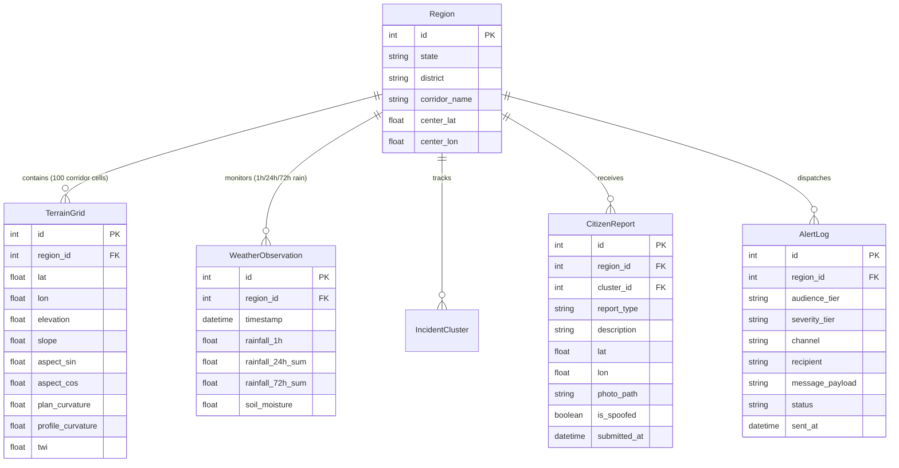

# NER-DRISHTI: Backend System Architecture & Knowledge Base

This document provides a comprehensive technical blueprint of the **NER-DRISHTI** backend service. It details the server structure, database schema, service layer logic, REST API contracts, machine learning inference engine, and multi-region routing pipeline.

---

## 1. Executive Summary & Purpose

The backend acts as the core decision-support engine for the NER-DRISHTI Landslide Early-Warning System. It is built with **Python 3.13** and **FastAPI**. 

It handles:
1. **Dynamic Risk Inference & GeoJSON Grid Generation**: Serves corridor-aligned hazard grid cells colored by risk severity tiers.
2. **Explainable AI (XAI)**: Calculates TreeSHAP contribution factors explaining the drivers behind every prediction.
3. **Evacuation Routing & Road Impact Assessment**: Evaluates primary vs. alternate highway routes against active Critical risk cells per region.
4. **Weather Telemetry Ingestion**: Automatically polls live weather telemetry (rainfall accumulation & soil moisture) from Open-Meteo API.
5. **Citizen Report Ingestion & EXIF Verification**: Processes user reports, detects photo coordinate spoofing, and clusters nearby incident reports.
6. **Multi-Tier Alert Dispatch**: Generates audience-scoped alerts (Authority SDMA vs. Public).

---

## 2. Directory Structure & Architecture

```text
backend/
├── main.py               # FastAPI application entry point, CORS, Rate limiting & REST routes
├── models.py             # SQLAlchemy ORM models (SQLite nerdrishti.db)
├── database.py           # Async database engine & session creation (aiosqlite)
├── seed.py               # Idempotent database seeder (Regions, Corridor cells, Demo alerts)
├── requirements.txt      # Dependency manifest
└── services/             # Domain logic and service layers
    ├── ingest.py         # Weather telemetry ingest from Open-Meteo REST API
    ├── inference.py      # XGBoost ML inference & TreeSHAP explainer engine
    ├── routing.py        # Safe evacuation route calculation & hazard intersection
    ├── reports.py        # Citizen report clustering & incident management
    ├── verification.py   # Multi-signal confidence verification loop
    ├── alerts.py         # Multi-tier notification dispatching
    └── exif.py           # Photo EXIF coordinate extraction & spoof detection
```

---

## 3. Tech Stack & Dependencies

* **Python 3.13**: Runtime environment.
* **FastAPI**: Modern, asynchronous web framework for REST API construction.
* **Uvicorn**: ASGI server runner.
* **SQLAlchemy 2.0 (Async) + aiosqlite**: Asynchronous ORM and driver for SQLite storage (`nerdrishti.db`).
* **HTTPX**: Async HTTP client for polling external meteorological APIs.
* **Slowapi**: IP-based API rate limiting (`60 requests/minute`).
* **XGBoost & SHAP**: Machine learning inference and feature contribution attribution.
* **ExifRead**: Binary EXIF extraction for image coordinate verification.
* **PyJWT**: JSON Web Token authentication for authority role scoping.

---

## 4. Database Schema & Entity Relationships

The SQLite database (`nerdrishti.db`) maintains 6 primary tables:



---

## 5. Core Services & Logic Breakdown

### 5.1. Hazard Grid & Corridor Seeding Engine (`seed.py` & `main.py`)
* **Highway Corridor Geometry**:
  `seed.py` generates 100 georeferenced terrain grid cells per region aligned along actual highway waypoints:
  * **Region 1 (Arunachal Pradesh - NH-13)**: Bhalukpong (`27.15°N, 92.40°E`) $\rightarrow$ Rupa $\rightarrow$ Bomdila (`27.28°N, 92.60°E`).
  * **Region 2 (Sikkim - NH-10)**: Gangtok (`27.33°N, 88.61°E`) $\rightarrow$ Nathula Corridor (`27.42°N, 88.70°E`).
  * **Region 3 (Meghalaya - NH-6)**: Shillong (`25.57°N, 91.88°E`) $\rightarrow$ Cherrapunji (`25.35°N, 91.70°E`).
* **Polygon Extent (`d = 0.002`)**:
  `GET /api/v1/risk/grid` constructs polygon boundaries with `d = 0.002` degrees (~400m cell size), providing visual separation between cells along the corridor strip.
* **Risk Probability Calculation**:
  $$\text{Probability} = \min\left(1.0, \max\left(0.0, \frac{\text{slope}}{45.0} \times 0.4 + \frac{\text{elevation}}{3000.0} \times 0.2 + \text{rain\_modifier}\right)\right)$$
  Where `rain_modifier` accounts for live telemetry or simulated cloudburst deltas (`rainfall_delta / 200.0`).

### 5.2. Explainable AI & Inference (`services/inference.py`)
* **Inference Pipeline**:
  `predict_risk(lat, lon)` queries terrain slope, elevation, and 72h cumulative rainfall. Passes features to the XGBoost classifier.
* **TreeSHAP Attribution**:
  Extracts SHAP contribution values for features:
  * `slope`: Slope Gradient
  * `elevation`: Elevation (DEM)
  * `rainfall_72h`: 72-Hour Cumulative Rainfall
  * `soil_moisture`: Soil Saturation Level
  * `distance_to_road`: Proximity to Road Cut
* Returns probability, severity tier (*Low*, *Moderate*, *High*, *Critical*), and ordered SHAP driver list.

### 5.3. Safe Evacuation Routing & Road Impact Engine (`main.py`)
* **Region-Scoped Road Impact (`GET /api/v1/roads-impacted?region_id={id}`)**:
  Dynamically filters affected road segments based on active `region_id`:
  * **Region 1**: `NH-13` (Critical, Bhalukpong–Bomdila Stretch) & `SH-4` (High, Tenga Valley Cut)
  * **Region 2**: `NH-10` (Critical, Gangtok–Nathula Corridor) & `Ranka Road` (Moderate)
  * **Region 3**: `NH-6` (Critical, Shillong–Cherrapunji Highway) & `Mawkdok Road` (High)
* **Evacuation Router (`GET /api/v1/routes/safe?region_id={id}`)**:
  * Defines primary and alternate highway LineString coordinates per region.
  * Evaluates primary route points against active Critical risk cells.
  * If an intersection occurs, sets `is_primary_blocked = True`, returns the alternate navigation path, and sets `avoided_segment` (e.g. `"Gangtok Slide Cut (KM 24)"`).
  * Returns corridor name, distance (km), estimated time (min), and bounding center coordinates for frontend camera auto-centering (`map.flyTo`).

### 5.4. Weather Ingestion Service (`services/ingest.py`)
* Background service polls Open-Meteo REST API for precipitation and soil moisture telemetry.
* Aggregates 1h, 24h, and 72h rainfall sums and persists updates into `WeatherObservation`.

### 5.5. Citizen Report & EXIF Verification (`services/exif.py` & `reports.py`)
* Reads EXIF tags from uploaded photos (`ExifRead`).
* Compares photo GPS coordinates against submitted user coordinates. Flagged as `is_spoofed = True` if discrepancy exceeds tolerance.
* Groups verified reports within 300 meters into `IncidentCluster` entities.

---

## 6. Complete API Reference

| Endpoint | Method | Params | Description |
| :--- | :--- | :--- | :--- |
| `/api/v1/regions` | `GET` | None | Returns list of supported regions & center coordinates |
| `/api/v1/risk/grid` | `GET` | `region_id`, `rainfall_delta` | GeoJSON FeatureCollection of 100 corridor cells |
| `/api/v1/risk` | `GET` | `lat`, `lon` | Risk prediction & SHAP explanation factors |
| `/api/v1/roads-impacted` | `GET` | `region_id` | Region-specific impacted highway segments |
| `/api/v1/routes/safe` | `GET` | `region_id` | Evacuation route calculation & avoided segment |
| `/api/v1/history/replay` | `GET` | None | Timeline scrubber frames for event simulation |
| `/api/v1/weather/current` | `GET` | `region_id` | Latest 1h/24h/72h rain and soil moisture readings |
| `/api/v1/alerts` | `GET` | None | List of active authority & public alerts |
| `/api/v1/reports` | `GET` | None | List of citizen reports & incident clusters |
| `/api/v1/reports/submit` | `POST` | Multipart Form | Submit user incident report with photo upload |
| `/api/v1/simulate/rain` | `POST` | `enable: bool` | Toggle cloudburst simulation mode |
| `/api/v1/token` | `POST` | `username`, `password` | OAuth2 JWT token authentication |

---

## 7. Execution & Operating Instructions

```powershell
# 1. Navigate to backend workspace
cd backend

# 2. Activate Python 3.13 virtual environment
.\venv\Scripts\Activate.ps1

# 3. Install requirements
pip install -r requirements.txt

# 4. Seed database idempotently (Populates regions, corridor cells, demo alerts)
python seed.py

# 5. Launch FastAPI development server with auto-reload on port 8001
python -m uvicorn main:app --reload --port 8001
```

---

## 8. Architectural Summary

1. **Decoupled Architecture**: High-speed, stateless FastAPI endpoints serving REST JSON and GeoJSON outputs.
2. **Corridor-Aligned GIS Seeding**: 100 georeferenced cells per region strictly following national highway paths (NH-13, NH-10, NH-6).
3. **Region-Scoped Operations**: Impacted road detection and evacuation routing dynamically react to selected `region_id`.
4. **Resilient Data Pipeline**: Satellite and weather API ingest fallback with offline-ready database persistence.
